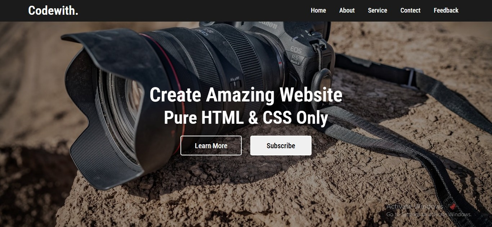

# 🌐 Simple Website using HTML & CSS

This project is a **simple and clean website layout** created using **pure HTML and CSS only**.  
The design focuses on a **hero section with a background image**, navigation bar, and call-to-action buttons.  
No JavaScript or external libraries are used in this project.

---

## 📸 Preview



---

## 🚀 Features
- 🖼️ **Background image hero section**
- 🧭 **Navigation bar** with menu links
- 🎨 Clean and modern UI design
- ⚡ Built using **only HTML & CSS**
- 🧼 Beginner-friendly code structure
- ❌ No JavaScript used
- ❌ Not responsive (desktop layout)

---

## 🛠️ Technologies Used
- **HTML5**
- **CSS3**

---

## 📂 Project Structure
```bash
├── index.html        # Main HTML file
├── style.css         # CSS styling file
├── layout-1.avif     # Background image
└── screenshot.jpeg   # Website preview image
```

## 🔧 How to Use
1. Clone the repository:
```bash
git clone https://github.com/Farah-Saleem270/simple-web
```
2. Open the project folder:
```bash
cd simple-web
```
3. Open index.html in your browser.
4. Enjoy the simple HTML & CSS design ✨


## 📌 Note
This project is created for practice and learning purposes.
It demonstrates how to build a basic website layout using background images and CSS styling only.

## 👩‍💻 Author
Created with ❤️ by Farah Saleem
GitHub: Farah-Saleem270

⭐ If you like this project, don’t forget to give it a star on GitHub!